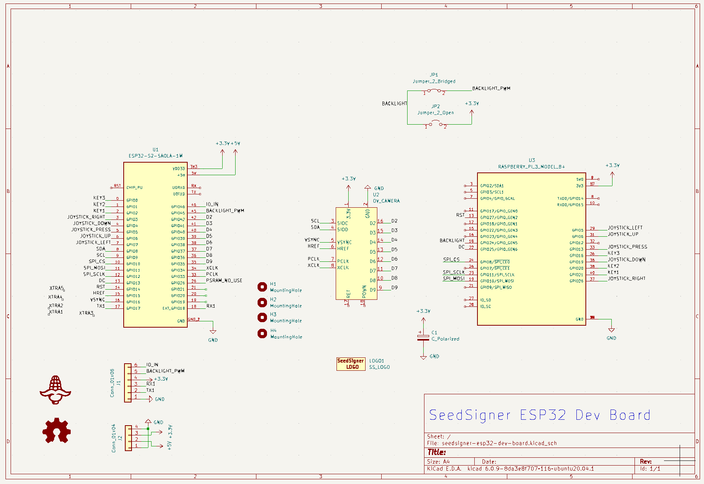
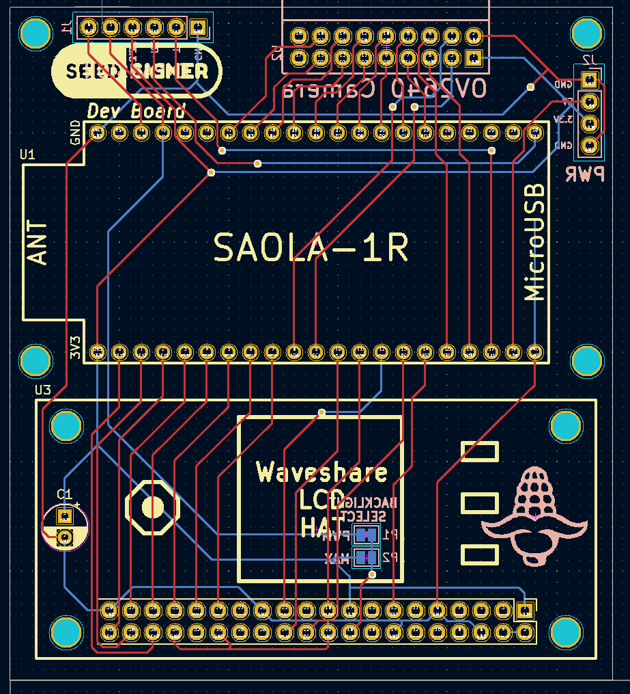

# SeedSigner ESP32 Dev-Board
A way to quickly get more developers working on ESP32 code, without having to worry about making it on a breadboard.

# Breadboard Wiring Instructions
The schematic was based on the instructions in this repo

[Keith's wiring instructions](https://github.com/kdmukai/micropython-esp32/tree/main/docs/saola_1r_build)

# Resources
[ESP32 Datasheet](https://www.espressif.com/sites/default/files/documentation/esp32-s2_datasheet_en.pdf)

[Saola User Guide](https://docs.espressif.com/projects/esp-idf/en/latest/esp32s2/hw-reference/esp32s2/user-guide-saola-1-v1.2.html)

[3.3V Regulator Datasheet](http://cn.sg-micro.com/uploads/soft/20220506/1651835177.pdf)

[OV2640 Camera Module](https://www.uctronics.com/download/OV2640_DS.pdf)

[Waveshare 1.3in LCD Hat](https://www.waveshare.com/wiki/1.3inch_LCD_HAT)

# Power Budget
* LDO:      +800mA @ 3.3V
* OV2640:   -60mA  @ 3.3V (max)
* LCD:       -??mA @ 3.3V
* ESP32:    -310mA @ 3.3V (max)

# Pictures

## Schematic

## PCB
